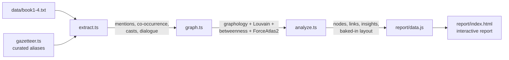

# Potter Graph

An entity/relation graph mined from the plain text of the first four Harry Potter
books, plus a self-contained interactive report to explore it.

Everything — characters, spells, places, creatures, houses — is pulled straight out of
the prose, wired together by who shows up with whom, and dropped into a browsable network.


## What it does

- **Reads** books 1–4 as raw text.
- **Extracts** ~150 entities across five types using a curated gazetteer with alias
  resolution (so *Harry*, *Potter* and *Mr. Potter* all collapse to one node).
- **Relates** them three ways: sentence-level **co-occurrence** (the social backbone),
  **spell-casting** (who casts what), and **dialogue** (words spoken per character).
- **Analyses** the network — degree, betweenness centrality, and Louvain communities.
- **Ships** it all into `report/index.html`: a force-directed graph you can pan, zoom,
  filter and click, with charts and a handful of written insights.

## Quick start

```bash
npm install
npm run build          # downloads the books, extracts, analyses, writes report/data.js
open report/index.html # or: npm run report  (serves it on a local port)
```

`npm run build` prints a summary so you can sanity-check the extraction:

```
nodes: 157   edges: 1289   mentions: 28151
dialogue: 3265/12801 quotes attributed (25.5%)

top 5 by mentions:
  Harry Potter         8102
  Ron Weasley          2925
  Hermione Granger     2132
  ...
```

The report is a single HTML file plus a generated `data.js` — no server, no CDN, no build
step for the browser. Double-clicking `index.html` is enough.

> Books aren't committed (see `.gitignore`). `npm run build` fetches them from a public
> mirror on first run; if you're offline, drop `book1.txt`…`book4.txt` into `data/`.

## Demo


## How it flows



`build.ts` runs that chain end to end. The layout is computed at build time, so the browser
just draws the result — which is why the report needs zero graph libraries client-side.

## The data structure

A typed, multi-relation graph. Each **node** is an entity:

```jsonc
{
  "id": "harry-potter", "label": "Harry Potter", "type": "character",
  "mentions": 8102, "wordsSpoken": 5114, "books": [1,2,3,4],
  "degree": 128, "betweenness": 0.044, "community": 0,
  "x": ..., "y": ...            // ForceAtlas2 position, baked in
}
```

Each **link** is a typed, weighted, book-tagged edge (`cooccurs` or `casts`). That shape is
enough to drive every view in the report — the graph, the filters, the leaderboards and the
per-node detail panel — from one file.

## Questions you might ask

**Why a gazetteer instead of an NLP model / NER?**
Precision. A closed, hand-checked vocabulary almost never invents a false character, and it
runs in a second with no model to ship. The cost is recall — see `DESIGN.md`, where a
"discovery pass" surfaces the frequent capitalised words we *didn't* model so the gaps are
visible, not hidden.

**What does an edge actually mean?**
Co-occurrence in the same sentence. It's a proxy for association, not an assertion that two
characters interacted. Strong, but read it as "these appear together a lot," not as canon.

**How reliable is the spell-casting / dialogue attribution?**
Heuristic. Casting attributes a spell to the nearest preceding character in the sentence;
dialogue is matched on reporting-verb patterns (`"…," said Harry`). Dialogue attribution
covers ~25% of quoted lines — the rest are tagless back-and-forth with no local speaker cue.
Both are honest hints, not ground truth. Details and the precision/recall discussion live in
`DESIGN.md`.

**What's the surprising bit?**
The report leads with it: the character who ranks high on *betweenness* (a connector between
otherwise-separate clusters) sits well below that on raw mention count — a structural role
the "who's mentioned most" view completely misses.

**Can I add books 5–7 or more entities?**
Yes. Add the URLs in `download.ts` and extend the lists in `gazetteer.ts`; nothing else
changes.

## Layout

```
src/
  build.ts       orchestrator (npm run build)
  download.ts    fetch / cache the books
  gazetteer.ts   curated entities + aliases
  extract.ts     text  -> mentions, co-occurrence, casts, dialogue
  graph.ts       graphology graph + metrics + layout
  analyze.ts     insights, charts, export shape
  types.ts       shared types
report/
  index.html     the interactive report
  data.js         generated
DESIGN.md        approach, precision/recall, trade-offs
```
