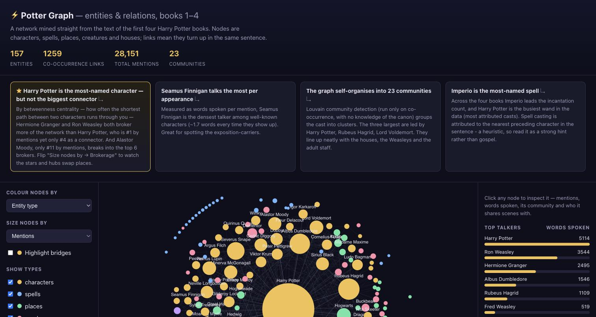
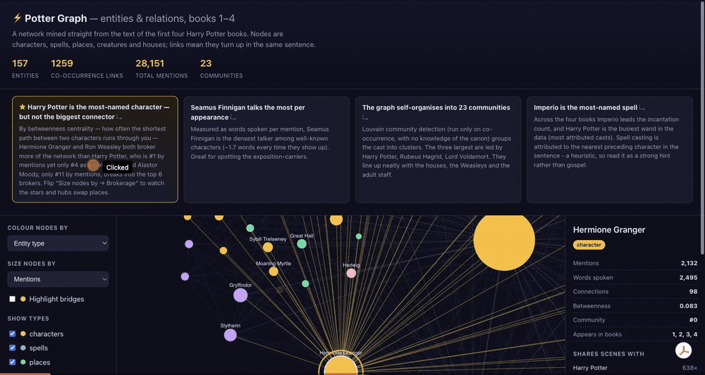
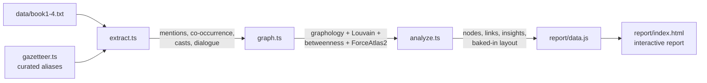

# Potter Graph

An entity/relation graph mined from the plain text of the first four Harry Potter
books, plus a self-contained interactive report to explore it.

Everything — characters, spells, places, creatures, houses — is pulled straight out of
the prose, wired together by who shows up with whom, and dropped into a browsable network.



## What it does

- **Reads** books 1–4 as raw text.
- **Extracts** ~150 entities across five types using a curated gazetteer with alias
  resolution (so *Harry*, *Potter* and *Mr. Potter* all collapse to one node).
- **Relates** them three ways: sentence-level **co-occurrence** (the social backbone),
  **spell-casting** (who casts what), and **dialogue** (words spoken per character).
- **Analyses** the network — degree, betweenness centrality, and Louvain communities.
- **Ships** it all into `report/index.html`: a force-directed graph you can pan, zoom,
  filter and click, with charts and a handful of written insights.

## Quick start

```bash
npm install
npm run build          # downloads the books, extracts, analyses, writes report/data.js
open report/index.html # or: npm run report  (serves it on a local port)
```

`npm run build` prints a summary so you can sanity-check the extraction:

```
nodes: 157   edges: 1289   mentions: 28151
dialogue: 3265/12801 quotes attributed (25.5%)

top 5 by mentions:
  Harry Potter         8102
  Ron Weasley          2925
  Hermione Granger     2132
  ...
```

The report is a single HTML file plus a generated `data.js` — no server, no CDN, no build
step for the browser. Double-clicking `index.html` is enough.

> Books aren't committed (see `.gitignore`). `npm run build` fetches them from a public
> mirror on first run; if you're offline, drop `book1.txt`…`book4.txt` into `data/`.

## Demo



## How it flows



`build.ts` runs that chain end to end. The layout is computed at build time, so the browser
just draws the result — which is why the report needs zero graph libraries client-side.

## The data structure

A typed, multi-relation graph. Each **node** is an entity:

```jsonc
{
  "id": "harry-potter", "label": "Harry Potter", "type": "character",
  "mentions": 8102, "wordsSpoken": 5114, "books": [1,2,3,4],
  "degree": 128, "betweenness": 0.044, "community": 0,
  "x": ..., "y": ...            // ForceAtlas2 position, baked in
}
```

Each **link** is a typed, weighted, book-tagged edge (`cooccurs` or `casts`). That shape is
enough to drive every view in the report — the graph, the filters, the leaderboards and the
per-node detail panel — from one file.

## Important considerations

The questions a reviewer tends to raise about a solution like this — grouped by theme and
answered straight, limitations included. The deeper precision/recall discussion lives in
[`DESIGN.md`](DESIGN.md).

### Extraction & accuracy

**Why a gazetteer instead of an NLP model / NER?**
Precision, and time. A closed, hand-checked vocabulary almost never invents a false entity and
runs in a second with nothing to train or ship. A statistical NER would raise recall on minor
or unnamed entities but bring a long tail of false positives ("Uncle", "Sunday", "Muggle-born")
that would eat the rest of the budget to clean up. For a fixed, well-documented universe of
~150 entities a reader can eyeball, curation is the right trade.

**How good is the extraction — precision and recall?**
Precision is high: the vocabulary is closed, so false entities are rare. Recall is bounded to
what's listed — anything not enumerated is invisible. Rather than hide that, the build runs a
**discovery pass** that prints the most frequent capitalised words *not* in the gazetteer
(`Quidditch`, `Dursleys`, `Goyle`, `Firebolt`, `Snitch`…). That's both a to-do list for
extending coverage and an honest measure of what's being missed.

**How are aliases and ambiguous names handled?**
Every entity carries its surface forms, and they collapse to one canonical node — *Harry /
Potter / Mr. Potter* → **Harry Potter**, *You-Know-Who / Tom Riddle* → **Lord Voldemort**.
Matching is longest-alias-first (so *Professor McGonagall* beats a bare *McGonagall*). Genuinely
ambiguous forms are handled deliberately: `Weasley` alone is **not** an alias (it spans a whole
family), and `Black` / `Wood` / `Fang` only match through full curated forms so their common-noun
senses don't leak in.

**Why case-sensitive matching?**
The source keeps its original capitalisation, so matching `Black`, `Wood` or `Fang`
case-sensitively suppresses "a black cloak" / "touch wood" without extra rules.

**What does a co-occurrence edge actually mean?**
That two entities appear in the same **sentence** — a proxy for association, not a claim that
they interacted. Read a strong edge as "these turn up together a lot," not as canon.

**Why sentence-level co-occurrence, not paragraph or a fixed word window?**
Sentence scope keeps links tight and interpretable. Paragraph scope would connect nearly
everyone to everyone; a raw token window would cut across sentence boundaries and add noise.

**How reliable is spell-casting attribution?**
It's a heuristic: each spell is attributed to the nearest preceding character in the same
sentence. It will misfire on "Harry watched Snape cast *Expelliarmus*", so it's framed in the
UI as a hint and kept **out** of the structural metrics.

**Why does dialogue attribution only cover ~25% of quoted lines?**
Attribution matches reporting-verb patterns in both orders (`"…," said Harry` and `Harry said,
"…"`). A lot of dialogue is tagless back-and-forth where the speaker is only inferable from
context a paragraph away — out of reach of a local rule. The lines that *are* attributed are
high-precision, so "who talks most" ranks correctly even though absolute word counts undercount.

**What about pronouns and coreference?**
Not resolved. "He raised his wand" contributes nothing to co-occurrence — a known recall gap,
and the first thing I'd add next (see `DESIGN.md`).

### Data & sourcing

**Where does the text come from, and what about copyright?**
It's fetched at build time from a public plain-text mirror and used purely for analysis. The
books are **not committed or redistributed** in this repo (`.gitignore`), and the raw text never
ships to the browser — only aggregate counts and the derived graph do.

**Why books 1–4?**
That was the agreed scope, and the chosen mirror carries those four with original casing and
straight quotes (which the extractor relies on). Adding 5–7 is a small change, not a rewrite.

**What if I'm offline or the mirror moves?**
Drop `book1.txt`…`book4.txt` into `data/` yourself; the pipeline uses the cached files and skips
the download.

### Graph & analysis

**Why a graph, and why graphology?**
A typed, multi-relation network is the natural shape for "entities linked several ways", and it
unlocks centrality and community analysis for free. `graphology` provides the model plus the
metric/community/layout packages, so none of that is hand-rolled.

**What do betweenness centrality and Louvain actually add?**
Betweenness surfaces **connectors** — nodes that sit on the shortest path between others — which
is the headline insight (the biggest connector isn't the most-mentioned character). Louvain finds
communities from co-occurrence alone, with no knowledge of canon, yet still recovers
house / Weasley / staff-shaped clusters — a nice sanity check that the signal is real.

**Which edges do the metrics run on?**
The co-occurrence backbone. `casts` edges are shown in the UI but excluded from centrality and
community detection, so a heuristic relation can't distort the structural picture.

**Why compute the layout at build time?**
ForceAtlas2 runs once during the build and the positions are baked into `data.js`. That's what
lets the report ship **zero** graph libraries client-side, and it makes the on-screen layout
reproducible instead of re-simulating on every load.

### The report

**Why no D3 / sigma / graph library in the browser?**
Because the layout is already computed, the client only needs to draw circles and lines and
hit-test clicks — a few hundred lines of canvas. A library would add weight and an offline/vendoring
story for no real gain, and it keeps the whole report a single file you can email.

**What can I actually do in it?**
Pan and zoom; click a node to inspect it (with neighbour highlighting); colour by entity type or
by community; **size nodes by mentions or by brokerage (betweenness)** — the toggle that makes the
headline insight visible; **highlight the "bridge" characters** (high brokerage, modest fame);
show/hide types; filter to a single book; drag a minimum-link-strength slider to peel the graph
back to its strongest ties; restrict to a **type-pair** (e.g. only creature↔place links); search
by name; and **click any insight card to fly the graph to the character it's about**.

**Does it work offline / by just double-clicking `index.html`?**
Yes. `data.js` loads via a plain `<script>` tag — no `fetch`, no CDN, no server required.

**Are the insights hand-written?**
They're **computed** from the graph at build time (`analyze.ts`) — the names and numbers are
filled in from the data, not hard-coded prose. Change the corpus and the insights change with it.

### Engineering & extending

**What's the surprising insight, and why is it surprising?**
The report leads with it: **Harry is the most-named character but not the biggest connector.** By
betweenness centrality, *Hermione* (0.083) and *Ron* (0.079) both broker more of the network than
Harry (0.044, #4), and *Mad-Eye Moody* — only 11th in mentions — cracks the top-6 brokers. You can
*see* it: flip **"Size nodes by → Brokerage"** and the stars shrink while the connectors swell, or
hit **"Highlight bridges"** to isolate the brokers (Moody, Krum, Cedric, Bagman) whose structural
role far outruns their fame. It's the role the intuitive "who's mentioned most" view misses entirely.

**How long does it take to run?**
A second or two once the ~2.6 MB of text is cached; the first run also spends a moment
downloading.

**Is it reproducible?**
Same input yields the same entities, counts and centralities. Community *numbering* can differ
between runs, but the grouping is stable.

**Can I add books 5–7 or more entities?**
Yes — add URLs in `download.ts` and extend the lists in `gazetteer.ts`. Nothing else changes.

**Tests?**
No automated suite in this time box; validation is the printed build summary plus spot-checks
against known passages. With more time I'd add fixture tests over a short excerpt with
hand-counted mentions and attributions.

## Layout

```
src/
  build.ts       orchestrator (npm run build)
  download.ts    fetch / cache the books
  gazetteer.ts   curated entities + aliases
  extract.ts     text  -> mentions, co-occurrence, casts, dialogue
  graph.ts       graphology graph + metrics + layout
  analyze.ts     insights, charts, export shape
  types.ts       shared types
report/
  index.html     the interactive report
  data.js         generated
DESIGN.md        approach, precision/recall, trade-offs
```
